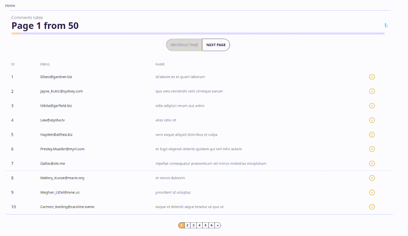

# Nuxt 3 Demo Comments



### Test it here:

1. Vercel: https://javascript-nuxt3-hooks-comments-demo.vercel.app/
2. AppEngine: https://nuxt3-demo-comments.appspot.com/

## Setup

Make sure to install the dependencies (prefer yarn)

```bash
yarn install
```

Add .env file to the root of the project with:

```
API_URL=https://jsonplaceholder.typicode.com
```

## Development

Start the development server on http://localhost:3000

```bash
yarn dev
```

## Production

Build the application for production:

```bash
yarn build
```

Checkout the [deployment documentation](https://v3.nuxtjs.org/docs/deployment).
